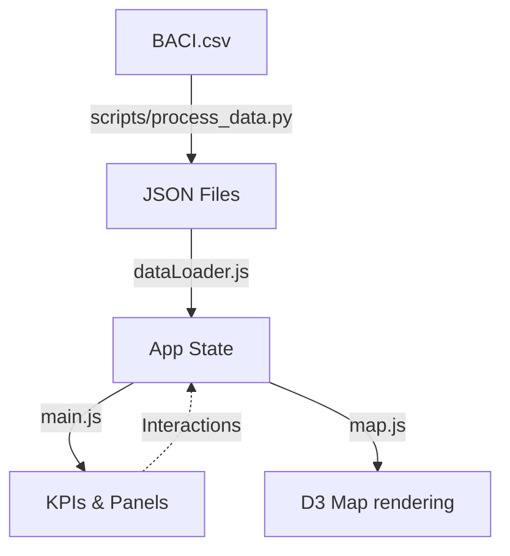
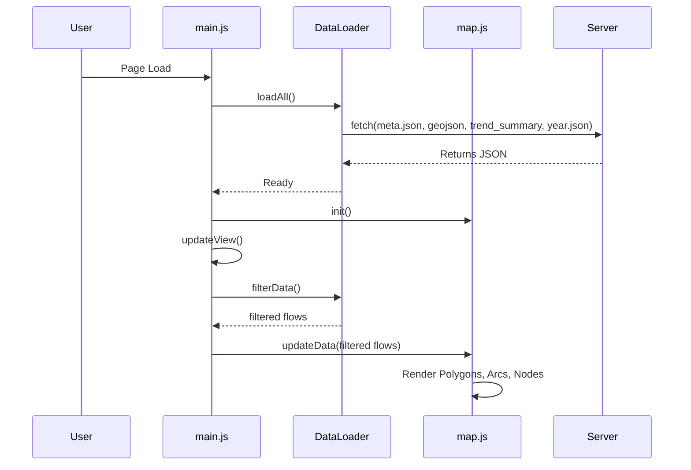
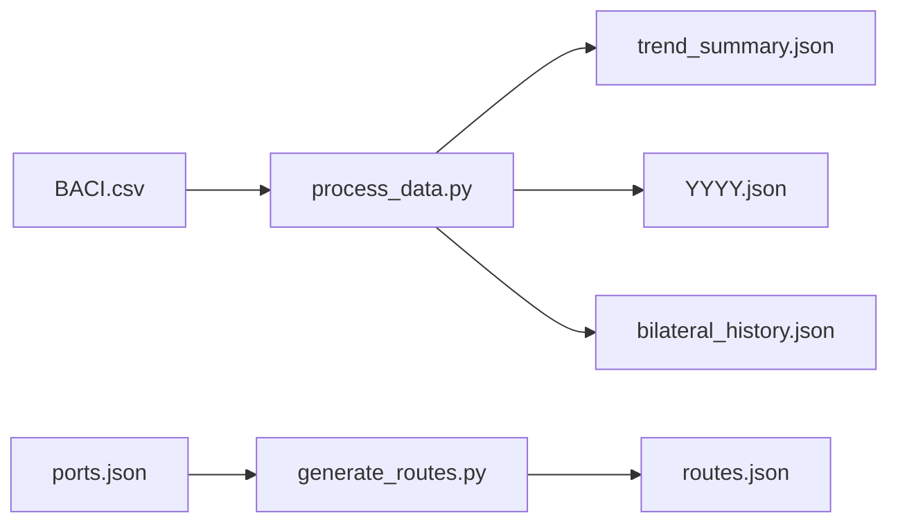

# PROJECT_TECHNICAL_OVERVIEW.md

# 1. Executive Summary

The Global Second-Hand Clothes Trade Monitor is a client-side, interactive data visualization web application. It allows users (e.g., policy makers, researchers, analysts) to explore the global trade of second-hand clothes (HS 6309) between 2015 and 2024.
The application helps answer analytical questions regarding the flow of second-hand clothing between countries, specifically examining trade volume, net balances, and the directionality of trade across development status groups (e.g., North to South).
The principal visualization model is an interactive geographic map rendering directed trade flows as arcs (or experimental sea routes) alongside a bar chart race animation, KPIs, and detailed country panels.
The major technologies used are HTML/CSS/JavaScript (Vanilla/ES Modules), D3.js for rendering, TopoJSON for map data, and Vite as the build tool. Data preparation is handled via Python scripts.
The application is a fully static client-side application backed by precomputed JSON files; there is no server-side component.
Its current implementation is highly mature (production-ready) but includes explicit "experimental" features like Sea Routes.
A major limitation visible from the architecture is that relying on precomputed static JSON files limits ad-hoc slicing (e.g., custom date ranges or different product codes) without running the Python pipeline, though it ensures fast client-side performance.

# 2. Repository Snapshot

- **Repository name**: unctad-shc-trade-visualization (SHC-trade-visualization - UNCTADstyled)
- **Current branch**: main
- **Current commit hash**: ffcd8a668da77e59f45a9c0ed617d4c1088720f7
- **Commit date**: Tue Jul 7 12:37:31 2026 +0200
- **Package/application version**: 1.0.0
- **Runtime versions required**: Node v24.15.0, npm 11.12.1, Python (for data scripts)
- **Package manager**: npm
- **Primary languages**: JavaScript, Python, HTML, CSS (Less/Tailwind)
- **Build tool**: Vite
- **Hosting/deployment target**: Static hosting (e.g., GitHub Pages) configured for base path `/SHC-trade-visualization/`
- **License**: Not determinable from the repository (no LICENSE file present)
- **Working tree status**: Clean

*Commands used:* `git status && git log -1 --format="%H %cd" && git branch --show-current && node -v && npm -v`

# 3. Repository Structure

```
.
├── docs/                # Documentation
├── public/              # Static assets and precomputed data
│   ├── assets/          # Images, TopoJSON
│   └── data/            # Precomputed JSON files (Value and Weight metrics)
├── scripts/             # Python data-processing scripts
├── src/                 # Client-side JavaScript and styles
│   ├── styles/          # Less files for styling
│   ├── tour/            # Guided tour logic
│   ├── config.js        # Global configuration and state definitions
│   ├── dataLoader.js    # Data loading and filtering logic
│   ├── map.js           # D3 map and flow rendering
│   ├── main.js          # Main application logic and UI wiring
│   ├── csvExport.js     # CSV generation logic
│   └── regions.js       # Region mappings
├── index.html           # Main application entry point
├── factsheet.html       # Additional UI page
├── sns.html             # Additional UI page
├── package.json         # npm dependencies and scripts
└── vite.config.js       # Vite build configuration
```

- **public/data/**: Contains the processed JSON files consumed by the browser.
- **scripts/**: Contains `process_data.py` and `generate_routes.py` which transform raw Comtrade/BACI CSVs into the static JSONs.

# 4. Local Setup and Commands

- **Prerequisites**: Node.js v24+, npm v11+, Python 3.
- **Install command**: `npm install`
- **Development command**: `npm run dev` (Invokes Vite dev server)
- **Production build command**: `npm run build` (Invokes `vite build`)
- **Preview/serve command**: `npm run preview` or `npm run start` (`vite preview --port 8080 --host`)
- **Test command**: Not determinable from the repository (no test command configured).
- **Lint command**: Not determinable from the repository (no lint command configured).
- **Data preparation**: `python scripts/process_data.py` and `python scripts/generate_routes.py`
- **Expected local URL**: `http://localhost:5173/` (or 8080 depending on the command)
- **Setup problems**: Running `npm run build` executed successfully without issues.

# 5. Architecture Overview

The application is a pure client-side SPA.

- **Application entry point**: `index.html` loads `src/main.js`.
- **Initialization**: `App.init()` kicks off data loading via `DataLoader.loadAll()`.
- **State-management**: Centralized in the `STATE` object inside `src/config.js`, which holds active filters (year, metric, selected countries, thresholds).
- **Data loading**: JSON files are fetched dynamically depending on the selected year and metric (Value vs Weight). `data/` is used for USD, `data/weight/` for Kg.
- **Data transformation**: Done primarily in Python. The client-side `DataLoader.filterData()` only applies UI filters (region, threshold, flow categories).
- **Geographic rendering**: `src/map.js` uses D3 and TopoJSON to render landmasses and borders (with disputed territory styling).
- **Flow rendering**: Map draws arcs between country centroids. Arcs use `Math.sqrt` scaling. Sea routes are drawn if inter-regional.
- **Export mechanism**: `csvExport.js` constructs blobs dynamically and triggers downloads.

### Mermaid Diagrams





# 6. Complete Runtime Flow

1. **Execution starts** in `src/main.js` `App.init()`.
2. **Initial settings** are selected from `index.html` DOM state (e.g. year=2024, metric=value).
3. **Data fetching**: `DataLoader.loadAll()` loads `geoJsonUrl`, `meta.json`, `trend_summary.json`, and `2024.json` sequentially via `Promise.all`.
4. **Data parsing**: `DataLoader.processGeoData()` extracts centroids from TopoJSON, overriding with `meta.json` coordinates.
5. **Filtering**: `App.updateView()` calls `DataLoader.filterData()`. The code filters pre-computed net flows based on region, country selection, flow category, and calculates the adaptive threshold (`computeAutoThreshold`).
6. **Rendering**: `TradeMap.updateData()` receives the filtered flows. It performs full re-rendering of arcs (`.flow-arc`), nodes (`.flow-node`), and updates sizes using `Math.sqrt(netBalance)`.
7. **Interactions**: Clicks on nodes open country panels (`_buildConcentrationGauge`), computing HHI on the fly from pre-threshold data.
8. **Animations**: The bar chart race is triggered by `#anim-btn`, managing an interval that increments the year.

# 7. Data Inventory

- **BACI.csv**: Raw bilateral trade data. ~16MB. Fields: Year, reporterDesc, partnerDesc, export value, export weight, coords. (Processed by Python).
- **worldmap-economies-4326.topo.json**: Geographic boundaries.
- **meta.json**: Country names and fallback coordinates.
- **trend_summary.json**: Gross trade volume per country per year.
- **[YYYY].json** (e.g., 2024.json): Net flows per year. Fields: `exporter`, `importer`, `netValue`, `flowCategory`. Size: ~450KB each.
- **bilateral_history.json**: Raw directional flows per pair per year.
- **ports.json**: Representative ports for each country.
- **routes.json**: Precomputed maritime sea routes using `searoute`. ~12MB.

# 8. Data Lineage and Preparation

- **Original Source**: UN Comtrade / BACI.
- **Transformation Script**: `scripts/process_data.py`
  - **Inputs**: `BACI.csv`
  - **Steps**:
    1. Reads rows, applies `NAME_TO_ISO` mapping.
    2. Drops non-state entities (e.g. 'Bunkers').
    3. Calculates Net Bilateral Flow: True netting (`aToB - bToA`).
    4. Applies North/South classification based on `DEVELOPMENT` config (hardcoded in Python and JS).
    5. Outputs `trend_summary.json`, `[YYYY].json`, `bilateral_history.json`.
- **Sea Route Generation**: `scripts/generate_routes.py`
  - **Inputs**: `ports.json`
  - **Steps**: Computes path between ports using `searoute` library.
  - **Outputs**: `routes.json`.



# 9. Data Schema and Field Dictionary

For runtime datasets like `2024.json`:

- `exporter`: ISO3 string. The country exporting more in the net balance.
- `importer`: ISO3 string. The country importing more in the net balance.
- `netValue`: Float. The net trade value. Represents either USD or Kg depending on the directory.
- `flowCategory`: String. Allowed values: `north-south`, `south-north`, `south-south`, `north-north`.

# 10. Domain and Analytical Logic

## 10.1 Trade Measure

- **Interpretation**: Toggled via UI. "Value" uses USD, "Weight" uses kg.
- **Switching**: Modifies the directory `DataLoader` loads from (`data/` vs `data/weight/`). All KPIs, flows, and thresholds are fully recomputed on toggle.

## 10.2 Bilateral Pair Construction

- **Methodology**: True netting. `net = aToB - bToA`.
- **Implementation**: Found in `scripts/process_data.py`. If A exports 10 to B, and B exports 8 to A, the net flow is 2 from A to B.
- **Double Counting**: Avoided by calculating a single net directional flow per pair.

## 10.3 North/South Classification

- **Source**: Hardcoded dictionary `DEVELOPMENT` in `src/config.js` and `scripts/process_data.py`. Developed countries are 'north', others default to 'south'.

## 10.4 Threshold Logic

- **Implementation**: `DataLoader.computeAutoThreshold`.
- **Logic**: Target max arcs is 40. Floors scale based on selection size (0 countries: $10M, 1-3: $10K, etc). Sorts flows by netValue; if >40 flows exceed the floor, threshold is raised to the 40th largest value.

## 10.5 Flow Geometry

- **Formula**: Standard SVG arc. `src/map.js` line 758: `dr = Math.sqrt(dx^2 + dy^2) * 1.3`.
- **Sweep direction**: Always clockwise (`sweep-flag = 1`).

## 10.6 Sea Routes

- **Usage**: Used only when `searouteMode` is true AND the flow is inter-regional (different UNCTAD regions defined in `src/regions.js`).
- **Data**: Loaded from precomputed `routes.json`.

## 10.7 KPIs and Rankings

- KPIs (Global Volume, #1 Exporter/Importer, etc) are derived from the dynamically thresholded and filtered `STATE.filteredData` and `STATE.nodeStats`.

## 10.8 Country-Level Detail

- **HHI (Herfindahl-Hirschman Index)**: `src/main.js` `_buildConcentrationGauge`.
- **Formula**: `sum(share^2) * 10000`. Computed on pre-threshold data to ensure accuracy.

## 10.9 CSV Export

- **Export logic**: `src/csvExport.js`. Ignores on-screen display thresholds (exports all data within the scope). Uses true data dimensions (USD, kg) directly.

# 11. User Interface Inventory

- **Region Filter**: Filters `STATE.region`.
- **Year Select**: Filters `STATE.year`.
- **Value/Weight Toggle**: Switches `STATE.metric`.
- **Flow Checkboxes**: Filters `STATE.flowFilters`.
- **Threshold Buttons**: Modifies `STATE.thresholdMode`.
- **CSV Export**: Triggers `csvExport.js`.
- **Animate Button**: Starts year progression interval.

# 12. State Model

- **Source of Truth**: `STATE` object in `src/config.js`.
- Variables: `year`, `metric`, `selectedExporters`, `selectedImporters`, `flowFilters`, `thresholdMode`.
- State changes trigger `App.updateView()`.
- State is NOT represented in the URL (no shareable links). A page reload resets the view.

# 13. Rendering and Visual Encoding

- **Map Projection**: Equirectangular (TopJSON pre-projected in UI, adjusted for UNCTAD bounds).
- **Flow Width**: Scaled proportionally using square root `Math.sqrt` in `src/map.js`.
- **Flow Color**: Categorical based on N/S flow (e.g. North-South is UNCTAD Blue `#009EDB`).
- **Country Nodes**: Circle radius based on gross volume.

# 14. Geographic Edge Cases

- **Missing geometries**: Fallback coordinates exist in `FALLBACK` in `process_data.py`.
- **Disputed borders**: Rendered using dashed/dotted paths from `worldmap-economies-4326.topo.json` objects.

# 15. Accessibility and Internationalization

- **Implementation**: Basic ARIA labels (`aria-expanded`, `aria-haspopup`) are present on dropdowns. Semantic HTML is used.
- **Internationalization**: Hardcoded to English. No i18n framework present.

# 16. Responsive and Cross-Browser Behavior

- Custom layout using CSS Flexbox/Grid.
- Mobile specific logic: Includes a bottom sheet for filters (`#mobile-filter-panel`), triggered on smaller viewports.

# 17. Performance Characteristics

- **Caching**: `yearCache` in `STATE` memoizes JSON fetches to avoid redundant network requests.
- **Bottlenecks**: Parsing large JSON files (e.g. `routes.json` is ~12MB, loaded async). The map renders SVGs, which could slow down if the 40-arc limit is bypassed manually.

# 18. Testing and Validation

- **Tests**: No test frameworks (Jest, Mocha, etc) or unit tests are present in the repository.

# 19. Build, CI, and Deployment

- **Build tool**: Vite. Output is in `dist/`.
- **Base path**: `vite.config.js` defines `base: '/SHC-trade-visualization/'` for GitHub pages compatibility.
- **Deployment**: Automatic deployment configs (e.g., GitHub Actions) are not explicitly visible in a `.github/workflows` folder in the inspected root tree (though `.github/` exists).

# 20. Dependencies

- **Direct dependencies**: `d3` (v7.9.0), `topojson-client` (v3.1.0).
- **Dev dependencies**: `vite`, `tailwindcss`, `less`, `playwright`, `autoprefixer`.

# 21. Configuration and Hard-Coded Assumptions

- Default year: 2024.
- Maximum arc count: 40.
- `DEVELOPMENT` dictionary explicitly hardcodes 'north' countries.

# 22. Documentation vs Implementation

1. **Confirmed by code**: HHI calculation matches docs, threshold caps at 40 arcs, sweep-flag=1 for curvature. True netting is implemented.
2. **Ambiguous**: "EXPERIMENTAL" sea routes (unclear if it reflects actual maritime cargo logic beyond simple pathfinding).
3. **Inconsistent**: None observed.

# 23. Code Quality and Maintainability

- Code is modularized (`config.js`, `main.js`, `map.js`, `dataLoader.js`).
- Clean separation of concerns between data fetching and rendering.
- Minimal dependencies limit supply chain risk.

# 24. Known Issues, Risks, and Uncertainties

- **Performance risks**: `routes.json` is ~12MB, which may cause slow initial load times on mobile. (Medium impact).
- **Data transparency**: Hardcoding N/S classifications means updates require code changes.

# 25. Improvement Backlog

- **Data transparency**: Move `DEVELOPMENT` classifications into a distinct static configuration JSON. (Effort: Small).
- **Performance**: Compress `routes.json` using TopoJSON or Protobufs to reduce payload size. (Effort: Medium).
- **UX**: Add URL state persistence for shareable views. (Effort: Medium).

# 26. Questions for the Original Developer

- Are there plans to externalize the `DEVELOPMENT` classification logic?
- Is there a specific threshold for transitioning Sea Routes out of the "EXPERIMENTAL" phase?
- What is the expected update cadence for the BACI Comtrade data?

# 27. Glossary

- **HHI**: Herfindahl-Hirschman Index, a measure of market concentration.
- **True Netting**: A method where A->B and B->A are subtracted to yield a single directional flow.
- **N->S**: Export from Developed to Developing economy.

# 28. File and Symbol Index

- `src/main.js`: `App` - UI and application lifecycle.
- `src/map.js`: `TradeMap` - Map rendering and interactions.
- `src/dataLoader.js`: `DataLoader` - JSON fetching and threshold filtering.
- `scripts/process_data.py`: `build_metric` - Python true-netting and JSON generation.

# 29. Reproduction Checklist

- [X] Clean checkout
- [X] Install (`npm install`)
- [X] Build (`npm run build`)
- [X] Load principal datasets
- [X] CSV export verification

# 30. Machine-Readable Appendix

```json
{
  "repository": {
    "name": "unctad-shc-trade-visualization",
    "branch": "main",
    "commit": "ffcd8a668da77e59f45a9c0ed617d4c1088720f7",
    "version": "1.0.0"
  },
  "stack": {
    "runtime": "Node v24.15.0",
    "packageManager": "npm",
    "framework": "Vanilla JS",
    "buildTool": "Vite",
    "visualizationLibraries": [
      "d3"
    ],
    "mappingLibraries": [
      "topojson-client"
    ]
  },
  "entryPoints": [
    "index.html",
    "sns.html",
    "factsheet.html"
  ],
  "importantFiles": [
    "src/main.js",
    "src/map.js",
    "src/dataLoader.js",
    "src/config.js",
    "src/csvExport.js"
  ],
  "dataFiles": [
    "public/data/BACI.csv",
    "public/data/meta.json",
    "public/data/routes.json"
  ],
  "dataPreparationScripts": [
    "scripts/process_data.py",
    "scripts/generate_routes.py"
  ],
  "mainComponents": [
    "App",
    "TradeMap",
    "DataLoader",
    "CsvExport"
  ],
  "mainStateVariables": [
    "STATE.year",
    "STATE.metric",
    "STATE.region",
    "STATE.selectedExporters",
    "STATE.selectedImporters",
    "STATE.thresholdMode"
  ],
  "mainCalculations": [
    "computeAutoThreshold",
    "computeStatsFromNetFlows",
    "_buildConcentrationGauge (HHI)"
  ],
  "userControls": [
    "Year Select",
    "Metric Toggle",
    "Region Filter",
    "Export View",
    "Threshold Controls",
    "Flow Category Filter"
  ],
  "externalServices": [],
  "buildCommands": {
    "dev": "vite",
    "build": "vite build",
    "preview": "vite preview"
  },
  "testCommands": {},
  "deployment": {
    "basePath": "/SHC-trade-visualization/"
  },
  "confirmedIssues": [],
  "uncertainties": [
    "Sea routes production readiness",
    "License model",
    "Update frequency"
  ]
}
```
